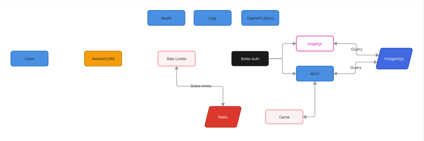

<div align="center">

# NestJS Backend Template

A production-ready NestJS backend template featuring authentication, distributed caching, rate limiting, GraphQL, and
more — designed to be scalable, observable, and easy to extend.

[](https://nodejs.org/)
[](https://nestjs.com/)
[](https://www.typescriptlang.org/)
[](https://www.postgresql.org/)
[](https://redis.io/)

</div>

---

## Table of Contents

- [Quickstart](#quickstart)
    - [Prerequisites](#prerequisites)
- [Why this template?](#why-this-template)
- [Features](#features)
- [Running Locally](#running-locally)
    - [Database Setup](#database-setup)
    - [Running the Application](#running-the-application)
    - [Running Tests](#running-tests)
- [Project Structure](#project-structure)
- [Architecture Overview](#architecture-overview)
    - [Why This Separation?](#why-this-separation)
    - [Configuration Approach](#configuration-approach)
    - [Infrastructure Modules](#infrastructure-modules)
    - [Request Flow](#request-flow)
    - [Where to Look](#where-to-look)
- [Production Checklist](#production-checklist)
- [Contributing](#contributing)

---

## Quickstart

### Prerequisites

- Node.js ≥ 20.0.0
- pnpm (recommended) or npm ≥ 10.0.0
- Docker (for local PostgreSQL + Redis)

```bash
pnpm install
cp .env.example .env

pnpm docker:up
pnpm db:generate && pnpm db:migrate
pnpm auth:migrate

pnpm start:dev
```

Then open:

- OpenAPI Docs (Scalar UI): `http://localhost:3000/api/docs`
- GraphQL: `http://localhost:3000/graphql`
- Health Checks: `http://localhost:3000/api/health`

> [!NOTE]
> Ports and routes may differ depending on your `.env` configuration.

---

## Why this template?

This template is built for teams who want to ship **production-grade NestJS services** quickly — without reinventing
foundational infrastructure.

It focuses on:

- **Strong defaults** (security, logging, config validation)
- **Scalability** (Redis-backed caching + throttling)
- **Observability** (structured logs + health checks for infra dependencies)
- **DX** (SWC builds, clean module boundaries, automated API docs)

---

## Features

| Feature                   | Description                                          |
|---------------------------|------------------------------------------------------|
| 🔐 **Authentication**     | BetterAuth                                           |
| 🚀 **Two-Level Caching**  | In-memory LRU + Redis distributed cache              |
| 🛡️ **Rate Limiting**     | Redis-backed distributed throttling                  |
| 🗄️ **Database**          | PostgreSQL with Drizzle ORM + Drizzle Kit            |
| 📊 **GraphQL**            | Apollo Server with auto-generated schema             |
| 🩺 **Health Checks**      | Terminus-based monitoring endpoints (infra modules)  |
| 📝 **Structured Logging** | Pino with JSON output                                |
| 📖 **API Documentation**  | OpenAPI (Nest CLI plugin) + Scalar UI                |
| 🔒 **Security**           | Helmet, CORS, validation pipes                       |
| ⚡ **Graceful Shutdown**   | Zero-downtime friendly shutdown hooks                |
| ⚙️ **Dynamic Config**     | Feature-oriented configuration with validation       |
| ⚡ **Fast Builds**         | SWC + Express (Fastify migration is straightforward) |

---

## Running Locally

### Database Setup

```bash
# Start PostgreSQL and Redis (using Docker)
pnpm docker:up

# Generate database migrations
pnpm db:generate

# Apply migrations
pnpm db:migrate

# Run BetterAuth migrations (creates auth tables)
pnpm auth:migrate
```

### Running the Application

```bash
# Development (with hot reload)
pnpm start:dev

# Production build
pnpm build
pnpm start:prod
```

### Running Tests

```bash
# Unit tests
pnpm test

# Watch mode
pnpm test:watch

# Coverage report
pnpm test:cov

# E2E tests
pnpm test:e2e
```

---

## Project Structure

```txt
src/
├── config/              # Configuration modules
├── health/              # Health check
├── infra/               # 
│   ├── auth/            # Authentication (BetterAuth)
│   ├── cache/           # Caching
│   ├── database/        # Drizzle ORM for PostgreSQL
│   ├── graphql/         # GraphQL with Apollo Server  
│   └── rate_limiter/    # Rate limiting
├── tools/               # Utilities (logger, OpenAPI)
├── app.module.ts        # Root application module
└── main.ts              # Application entry point
```

The application follows a **clean separation between infrastructure and business logic**. Infrastructure modules (
`src/infra/`) provide all the foundational, cross-cutting concerns that support your business logic — authentication,
caching, database access, etc. Your business logic (services, resolvers, controllers) consumes
these infrastructure capabilities without needing to know their implementation details.



### Why This Separation?

- **Modularity** — Each infra module is self-contained and can be replaced or upgraded independently
- **Testability** — Business logic can be tested in isolation by mocking infra dependencies
- **Consistency** — Cross-cutting concerns (auth, caching, rate limiting) are applied uniformly
- **Maintainability** — Clear boundaries make it easy to locate and modify specific functionality

### Where to Look

| If you want to...          | Look in...                                                                     |
|----------------------------|--------------------------------------------------------------------------------|
| Change database connection | `src/config/database.config.ts`                                                |
| Modify cache behavior      | `src/config/cache.config.ts`, `src/infra/cache/`                               |
| Adjust rate limits         | `src/config/rate-limiter.config.ts`                                            |
| Configure authentication   | `src/config/auth.config.ts`, `src/infra/auth/better_auth.ts`                   |
| Customize GraphQL          | `src/config/graphql.config.ts`, `src/infra/graphql/`                           |
| Add health checks          | `src/health/health.module.ts`                                                  |
| Add new infra module       | Create in `src/infra/`, add config in `src/config/`, import in `app.module.ts` |

---

## Production Checklist

Before deploying to production:

- [ ] Set a strong `AUTH_SECRET` (and rotate if needed)
- [ ] Ensure `POSTGRES_*` and `REDIS_*` env variables point to production infrastructure
- [ ] Verify CORS settings for allowed origins
- [ ] Verify Helmet/security headers match your environment (proxy/ingress)
- [ ] Configure trusted proxies if behind load balancers / ingress
- [ ] Ensure health checks are wired into your orchestration (K8s, ECS, etc.)
- [ ] Set up log shipping / ingestion (Datadog, ELK, Loki, etc.)
- [ ] Tune Redis TTLs, eviction policies, and memory limits
- [ ] Confirm graceful shutdown works with your orchestrator timeouts

---

## Contributing

PRs/Issues are welcome.

Suggested contribution guidelines:

- keep infra modules isolated and configurable
- add/extend health indicators when introducing new dependencies
- include tests for new behavior when feasible
- ensure linting and tests pass

---